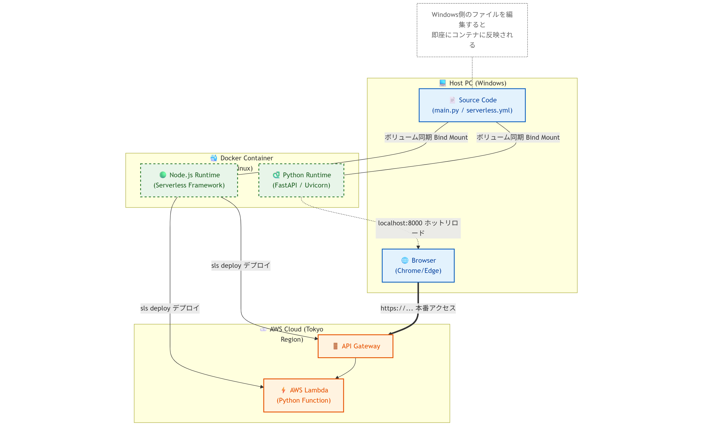

**記事タイトル:**
**【保存版】FastAPI × Serverless Framework開発の正解ルート：Dockerで環境汚染ゼロの爆速デプロイ**

### はじめに

「PythonでAPIを作って、AWSで公開したい！」 そう思った時、サーバー（EC2）を借りてOSの設定から始めるのは、今の時代少し遠回りかもしれません。

現在は、コードを置くだけで勝手に実行してくれる **「サーバーレス (AWS Lambda)」** という技術を使うのが、 **コストも手間も抑えられる** 賢い選択肢です。

しかし、これをWindows環境で実装しようとすると、途端に複雑になります。Pythonだけでなくデプロイ用のツール（Node.js製）も必要になり、それらがWindows特有の権限エラーやバージョン競合を引き起こすからです。

この記事では、 **「サーバーレスFastAPI」** というゴールに向けた、最も手堅く、エラーの起きない開発フロー **（正解ルート）** を解説します。

また、開発プロセスにおいて多くのエンジニアが直面しやすい、AWS IAM権限の細かな設定やリージョン指定の罠についても、具体的な解決策と共に網羅しています。

### 登場人物と役割（ここが重要！）
この記事では複数の技術が登場しますが、役割は完全に分かれています。まずはここを整理しましょう。

1. **FastAPI (Python): 【主役】**

   今回作りたいアプリケーション本体です。AWS上で実際に動き、リクエストを処理します。

1. **AWS Lambda + API Gateway: 【舞台】**

   FastAPIが動く場所です。サーバー（インスタンス）管理が不要で、使った分だけ課金される「サーバーレス」環境です。

1. **Serverless Framework (Node.js): 【裏方・配送業者】**

   **ここが混同しやすいポイントです。** これはAWS上で動くアプリではなく、手元のFastAPIコードをAWSに運び、設定を自動で行ってくれる**「デプロイツール」**です。このツールを動かすためにNode.jsが必要になります。

1. **Docker: 【清潔な作業部屋】**

   **AWSには行きません。** Windows上で直接PythonやNode.jsを動かすとエラーが出やすいため、開発とデプロイ作業を行うためだけの「隔離された作業環境」として使います。

**本記事のゴール** <br>
**「Dockerというクリーンな部屋の中で開発し、Serverless Frameworkという配送業者を使って、AWS Lambdaという舞台へFastAPIを送り出す」**

これを、ローカルのWindows環境を一切汚さずに実現します。

**この記事で得られる知見**
- **環境分離**: DockerだけでPythonとNode.jsが動く、使い捨て可能なハイブリッド環境の構築

- **サーバーレス**: インスタンスを作らずにAPIを公開する設計・デプロイ手法

- **トラブルシューティング**: AWS権限周りやバージョン不整合など、実務でハマりやすいポイントの回避策

---

### 事前準備（これから始める方へ）

この記事をスムーズに進めるために、以下の準備が必要です。まだの方は、別記事で詳しく解説していますので、そちらを先に済ませてから戻ってきてください。

> **🔗 準備編1： [【初心者向け】AWSアカウント作成とセキュリティ設定（IAMユーザー）の完全ガイド](draft_aws_setup.md\#はじめにawsを安全に使うために)**

> **🔗 準備編2： [Windowsユーザーのための環境構築トラブルシューティング](draft_windows_trouble.md\#はじめにwindowsでの開発は罠がいっぱい)**

### 完成イメージ

最終的には、以下のようなAPIがAWS上で稼働し、世界中からアクセスできるようになります。

*(ここにブラウザのスクリーンショットを配置します)*

> **（※仮画像イメージ：以下のようなテキストをコードブロックで表現するか、ご自身のブラウザのスクショに差し替えてください）**
>
> ```json
> {
>   "message": "Hello from Serverless FastAPI!",
>   "environment": "AWS Lambda (via Mangum)"
> }
> ```

-----

### Step 0: 今回のアーキテクチャ


今回はインフラ管理ツールとして **Serverless Framework** を採用しました。
AWS SAMやTerraformと比較して学習コストが低く、`serverless.yml` という設定ファイル一つでLambdaからAPI Gatewayまでを一元管理できるため、小規模なAPI開発における **「開発スピードと管理のしやすさのバランス（正解ルート）」** として最適だと判断しました。

*なぜ、あえてDockerを使うのか？ その理由と全体像を解説します。*

Serverless FrameworkでPythonアプリケーションをデプロイする場合、通常はホストマシンにPythonとNode.jsの両環境が必要です。しかし、この方法はOSごとの差異（パスの区切り文字やライブラリの依存関係）により、環境構築のコストが高くなる傾向にあります。

この課題を解決するため、**Dockerコンテナ内に実行環境を完全にカプセル化する**アプローチを採用しました。

#### システム構成図

以下の図のように、開発作業はすべてDockerコンテナ内で行い、そこからAWSへ直接デプロイします。ホストPC（Windows）は「コードを書くだけ」の状態に保たれます。

<a href="./img/mermaid-diagram-2025-12-03-134008.png" target="_blank">

</a>

*（画像はクリックで原寸表示）*

#### ディレクトリ構成

プロジェクトの全体像は以下の通りです。

```text
serverless-fastapi-demo/
├── Dockerfile             # Node.jsベースにPythonを追加した特製イメージ
├── docker-compose.yml     # ポート設定とボリュームマッピング
├── serverless.yml         # AWSデプロイ設定
├── main.py                # FastAPIアプリケーション
├── requirements.txt       # Python依存ライブラリ
└── .env                   # AWS認証情報（※Gitには含めない！）
```

-----
### Step 1: 最強のハイブリッドDocker環境を作る

#### 1\. Dockerfileの作成

プロジェクトルートに `Dockerfile` を作成します。

ここでは、以下のベストプラクティスを採用しています。

  * **軽量化:** ベースイメージに `node:24-slim` を採用し、イメージサイズを最小限に抑える。
  * **効率化:** `requirements.txt` をビルド時にインストールし、コンテナ起動ごとの待ち時間をなくす。
  * **セキュリティ:** 実行ユーザーを `root` ではなく `node` ユーザーに切り替え、権限を最小化する。

<!-- end list -->

```dockerfile:dockerfile
# 1. ベースイメージ
# Node.jsの軽量版(slim)を採用
FROM node:24-slim AS base

# 2. Python環境の追加
# Debian系なのでapt-getでPythonとpipをインストール
RUN apt-get update && apt-get install -y \
    python3 \
    python3-pip \
    python3-venv \
    && apt-get clean \
    && rm -rf /var/lib/apt/lists/*

# 3. 依存関係のインストール (Dependencies Stage)
FROM base AS dependencies
WORKDIR /usr/src/app
COPY package*.json ./
# 開発用ライブラリも含めてインストール
RUN npm install

# 4. 実行用ステージ (Final Stage)
FROM base AS final
WORKDIR /usr/src/app

# Node.jsの依存関係をコピー
COPY --from=dependencies /usr/src/app/node_modules ./node_modules

# Pythonライブラリのインストール
# root権限でシステム全体にインストールし、全ユーザーから使えるようにする
COPY requirements.txt ./

# 【Point】--break-system-packages について
# 最近のPython環境(Debian 12等)では、システム領域へのpip installが制限されています。
# しかし、このDockerコンテナは「アプリ専用の隔離された環境」であり、
# システムを破損させるリスクがないため、このオプションを付けて強制的にインストールします。
RUN pip install -r requirements.txt --break-system-packages

# セキュリティ対策: 実行ユーザーを一般ユーザー(node)に切り替え
USER node

# アプリケーションコードをコピー
COPY --chown=node:node . .

# ポート公開 (Express:3000, FastAPI:8000)
EXPOSE 3000 8000

# デフォルトコマンド
CMD [ "npm", "run", "dev" ]
```

#### 2\. docker-compose.ymlの作成

次に、コンテナの起動設定を行う `docker-compose.yml` を作成します。
ここでのポイントは、\*\*「ホスト（Windows）とコンテナ（Linux）の環境分離」\*\*です。

```yaml:docker-compose.yml
services:
  app:
    build:
      context: .
      target: final
    restart: unless-stopped
    
    # ポートマッピング
    # 3000: Serverless Offline / 8000: FastAPI
    ports:
      - "3000:3000"
      - "8000:8000"
      
    # ボリューム設定（ここが重要！）
    volumes:
      # 1. コードの変更を即座にコンテナに反映（ホットリロード用）
      - .:/usr/src/app
      
      # 2. コンテナ内のライブラリをホスト側で上書きしないように保護
      # これがないと、Windows側の空フォルダで上書きされ、動かなくなります
      - /usr/src/app/node_modules

      # 3. キャッシュ除外
      - /usr/src/app/__pycache__

    # AWS認証情報を環境変数として渡す
    env_file:
      - .env
```

#### 3\. 環境変数ファイル (.env) の作成
AWSの認証情報はコードに直接書かず、環境変数として管理します。
プロジェクトルートに `.env` ファイルを作成し、以下のように記述してください。<br>

> ※IAMユーザーの作成方法は以下のリンク先で解説しております<br>
>**🔗AWS IAMユーザー作成方法： [IAMユーザーを作る作成ガイド](draft_aws_setup.md\#step-3-最強のiamユーザーを作る)** 

```text:.env
# AWS IAMユーザーの認証情報
AWS_ACCESS_KEY_ID=あなたのアクセスキーID
AWS_SECRET_ACCESS_KEY=あなたのシークレットアクセスキー
```

※ この `.env` ファイルは機密情報を含むため、`.gitignore` に記述してGitHub等には絶対にアップロードしないでください。


#### 4\. 除外設定 (.dockerignore)

不要なファイルをコンテナに送らないよう、`.dockerignore` も設定します。特に `node_modules` と `venv` を除外することは、ビルド時間の短縮とエラー防止に必須です。

```text:.dockerignore
node_modules
venv
.git
.env
__pycache__
.serverless
```

#### 5\. 初期設定ファイル (package.json) の生成と編集
Dockerfile内には `COPY package*.json ./` と `RUN npm install` という記述がありますが、現時点ではまだ `package.json` が存在しません。 そのため、いきなりビルドするとエラーになります。

まずはDockerを使って、初期ファイル (`package.json`) を生成しましょう。 以下のコマンドを実行します。

```PowerShell
# 一時的なコンテナを起動して、npm init を実行し package.json を生成
docker run --rm -v "${PWD}:/usr/src/app" -w /usr/src/app node:24-slim npm init -y
```
これで `package.json` が生成されますが、中身を見てみてください。`実はこれだけだと動きません`。 以下のような、ごくシンプルな内容になっているはずです。

```JSON
{
  "name": "app",
  "version": "1.0.0",
  "scripts": {
    "test": "echo \"Error: no test specified\" && exit 1"
  },
  ...
}
```

このままでは、Dockerを起動したときに実行したいコマンド（dev）や、必要なライブラリ（serverless 等）が足りません。

**VS Codeで `package.json` を開き、以下のように修正・追記してください。**
```JSON
{
  "name": "serverless-fastapi-demo",
  "version": "1.0.0",
  "description": "",
  "main": "index.js",
  "scripts": {
    "test": "echo \"Error: no test specified\" && exit 1",
    
    // 【重要】ここを追加！
    // ホットリロード対応でサーバーを起動するコマンドを定義します
    "dev": "nodemon -L index.js"
  },
  "keywords": [],
  "author": "",
  "license": "ISC",
  
  // 【重要】ここを追加！
  // 必要なライブラリを定義しておきます（ビルド時にインストールされます）
  "devDependencies": {
    "nodemon": "^3.0.1",
    "serverless": "^3.38.0",
    "serverless-python-requirements": "^6.0.0"
  }
}
```

#### 6\. コンテナの起動
`package.json` ができたので、いよいよコンテナをビルド・起動します。
```PowerShell
docker compose up -d --build
```

これで、OSの差異に悩まされない堅牢な開発環境の定義が完了しました。

-----
### Step 2: FastAPIアプリケーションの実装

環境ができたら、アプリケーションの心臓部となるPythonコードを実装します。

通常、FastAPIは `uvicorn` というASGIサーバーを使って動かしますが、AWS Lambda上で動かすには、Lambdaのイベント形式をASGI形式に変換するアダプターが必要です。
そこで登場するのが **`Mangum`** というライブラリです。

#### 1\. main.pyの実装

プロジェクトルートに `main.py` を作成します。
開発中（ローカル）でも、本番（Lambda）でも同じコードで動くように設計します。

```python:main.py
from fastapi import FastAPI
from mangum import Mangum

# 1. FastAPIインスタンスの作成
app = FastAPI(
    title="Serverless FastAPI Demo",
    description="Docker環境で開発し、AWS Lambdaにデプロイするデモアプリ"
)

# 2. ルートエンドポイント
@app.get("/")
def read_root():
    return {
        "message": "Hello from Serverless FastAPI!",
        "environment": "AWS Lambda (via Mangum)"
    }

@app.get("/health")
def health_check():
    return {"status": "ok"}

# 3. AWS Lambda用ハンドラー（ここが重要！）
# MangumがLambdaのイベントを受け取り、FastAPIに渡します
# serverless.yml ではこの変数を 'main.handler' として指定します
handler = Mangum(app)
```

#### 2\. requirements.txtの作成

必要なライブラリを定義します。

```text:requirements.txt
fastapi
uvicorn[standard]
mangum
```

#### 3\. Docker内での動作確認（ホットリロード）

コードを書いたら、動作確認を行います。 先ほど `docker compose up` でコンテナは既に起動している状態ですので、以下のコマンドで コンテナの中に入って サーバーを起動します。

```powershell
# 1. コンテナ内に入り、必要なライブラリをインストール（初回のみ）
# ※Dockerfileでインストール設定済みですが、念のため確認
docker compose exec app pip install -r requirements.txt --break-system-packages

# 2. Uvicornサーバーを起動
docker compose exec app python3 -m uvicorn main:app --host 0.0.0.0 --port 8000 --reload
```

ブラウザで `http://localhost:8000` にアクセスし、以下のJSONが表示されれば成功です。

```json
{"message":"Hello from Serverless FastAPI!","environment":"AWS Lambda (via Mangum)"}
```

また、`http://localhost:8000/docs` にアクセスすると、FastAPIが自動生成するSwagger UI（APIドキュメント）も確認できます。

これで、ローカルでの開発環境は整いました。次はいよいよ、このアプリをAWSへデプロイします。

-----
### Step 3: Serverless Frameworkの設定

いよいよAWSへのデプロイ設定です。
ここには、Windows × Docker環境特有の「落とし穴」がいくつか存在します。それらを回避するための**正解の設定ファイル**がこちらです。

#### 1\. serverless.ymlの作成

プロジェクトルートに `serverless.yml` を作成します。

>**※ Serverless Framework V3を採用する理由**
本記事では、あえて最新のV4系ではなく、安定版の**V3系**を採用しています。
V4系からは商用利用時のライセンスモデルが変更され、CLI実行時にアカウントへのログインが必須化されました。
学習用・ポートフォリオ用として「シンプルにIaC（Infrastructure as Code）を体験する」目的には、ログイン不要でオープンに使えるV3系が最適であると判断しました。

<br>

```yaml:serverless.yml
service: serverless-fastapi-demo

# 【重要】バージョン3系を明示的に使用
# 最新のV4系は破壊的変更が含まれるため、安定しているV3系を指定します
frameworkVersion: '3'

provider:
  name: aws
  # Dockerコンテナ内のPythonバージョンに合わせる
  runtime: python3.11
  
  # 日本からのアクセスを高速化するために東京リージョンを指定
  region: ap-northeast-1
  
  # IAM権限設定（デプロイ時に必要なロールを自動生成）
  iam:
    role:
      statements:
        - Effect: Allow
          Action:
            - lambda:InvokeFunction
            - lambda:InvokeAsync
          Resource: "*"

  # API Gateway (HTTP API) の設定
  httpApi:
    cors: true  # フロントエンドからの呼び出しを許可

functions:
  api:
    # main.py の handler変数を指定
    handler: main.handler
    
    # タイムアウト設定（デフォルト6秒だと短い場合があるため10秒に）
    timeout: 10
    
    # すべてのリクエストをFastAPIに流す設定
    events:
      - httpApi:
          path: /{proxy+}
          method: any

plugins:
  - serverless-python-requirements

custom:
  pythonRequirements:
    # 【技術解説】
    # 通常、Windowsからデプロイする場合は、Linux互換のネイティブライブラリ(numpy等)を
    # ビルドするために Dockerを使う必要があります (dockerizePip: true)。
    # しかし、今回は「既にLinuxコンテナの中にいる」ため、そのままビルドすれば
    # Lambda(Linux)と互換性があります。そのため false に設定し、ビルド時間を短縮します。
    dockerizePip: false
    
    # 【最重要ポイント】
    # コンテナ内のコマンド名は "python3" なので、プラグインに明示的に伝える
    # これがないと "python3.11.x not found" エラーで落ちる
    pythonBin: python3
```

#### 2\. デプロイ前の準備（プラグイン導入）

`serverless.yml` で指定したプラグインをインストールします。これもDockerコンテナ内で行います。

```powershell
# PythonライブラリをLambda用にパッケージングする必須プラグイン
docker compose exec app npm install -D serverless-python-requirements
```

---

### Step 4: デプロイと動作確認

設定が完了したら、いよいよAWSへデプロイします。
ここでも、**「Dockerコンテナの中からコマンドを打つ」** ことが鉄則です。

```powershell
# デプロイコマンドの実行
docker compose exec app npx serverless deploy
```

成功すると、ターミナルにエンドポイントのURLが表示されます。

```text
endpoints:
  ANY - https://xxxxxxxxxx.execute-api.ap-northeast-1.amazonaws.com/{proxy+}
```

このURLをクリックして、`{"message": ...}` が表示されればデプロイ完了です！
また、URLの末尾に `/docs` を付けることで、Swagger UI（APIドキュメント）にもアクセスできます。

-----

### 🚨 トラブルシューティング（ハマりポイント集）

開発中に直面しやすいエラーとその解決策をまとめました。

#### Q1. `No version found for 3` というエラーが出る

**原因:** Serverless Frameworkの最新版(V4)が入っているのに、設定ファイルでV3を指定しているため。
**解決策:** 以下のコマンドで、明示的にV3系をインストールし直してください。

```powershell
docker compose exec app npm install -D serverless@3
```

#### Q2. `User is not authorized to perform: ...` (403エラー)

**原因:** IAMユーザーの権限不足です。
**解決策:** AWSコンソールで、IAMユーザーに以下の許可ポリシーを追加してください。

  * `AWSCloudFormationFullAccess`
  * `AmazonS3FullAccess`
  * `CloudWatchLogsFullAccess`
  * `AWSLambda_FullAccess`
  * `AmazonAPIGatewayAdministrator`

#### Q3. デプロイは成功したのに画面が真っ白

**原因:** AWSリージョンを見間違えている可能性があります。
**解決策:** AWSコンソールの右上が「東京 (ap-northeast-1)」になっているか確認してください。デフォルトで「バージニア」や「シドニー」になっていると、リソースが見つかりません。

-----
### まとめ：エラーを乗り越えて得た「正解ルート」

お疲れ様でした！
ここまで長い道のりでしたが、これで **「Windows環境でも、ローカルを一切汚さずに、FastAPIとServerless Frameworkを動かす」** 最強の環境が手に入りました。

今回構築したアーキテクチャのメリットを改めて整理します。

1.  **環境汚染ゼロ:** PCにPythonやNode.jsをインストールする必要がなく、いつでも捨てて作り直せる。
2.  **チーム開発に強い:** `docker-compose up` だけで全員が同じ環境になれる。
3.  **実務レベルの構成:** AWS IAM権限やリージョン設定など、現場で必要な知識も網羅している。

このハンズオンを通して作成したリポジトリは、あなたの技術力を証明する立派な **ポートフォリオ** になります。ぜひGitHubにプッシュして、面接や職務経歴書でアピールしてください。

#### ⚠️ 忘れずにやること：リソースの削除

検証が終わったら、無駄な課金を防ぐためにAWS上のリソースを削除しておきましょう。
もちろん、これもDockerコンテナの中からコマンド一発です。

```powershell
# デプロイしたリソースを一括削除
docker compose exec app npx serverless remove
```

※ これを実行すると、API GatewayとLambda関数は削除されますが、IAMユーザーやCloudWatch Logsの一部は残る場合があります。気になる方はAWSコンソールから手動で確認・削除してください。

-----
